# PPS-Unidad0ActividadGit-Ramon

## Creación de Proyecto y repositorio

1. Crear una carpeta con el mismo nombre que la tarea y entrar en ella.

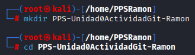
1. Crear repositorio público por defecto.
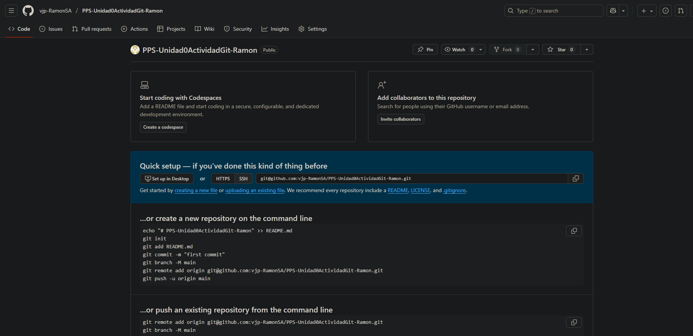  
1. Utilizar las indicaciones de github para hacerlo por ssh.
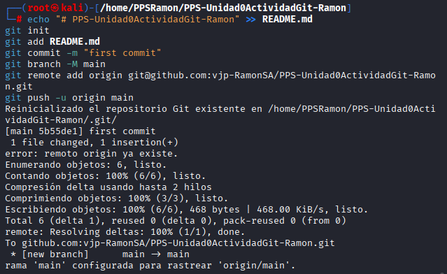  
1. Crear la estructura.
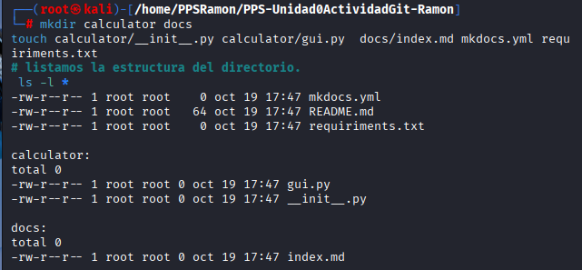  
1. Comprobar el estado del proyecto.
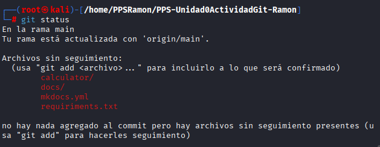  
1. Añadir los diferentes archivos creados.
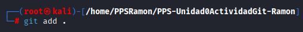
1. Comprobar el estado de los archivos.  
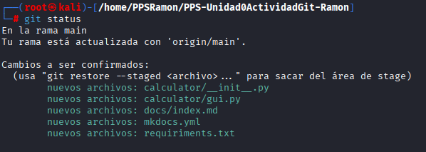  
1. Hacer listado en forma de árbol para ver que se han creado correctamente.
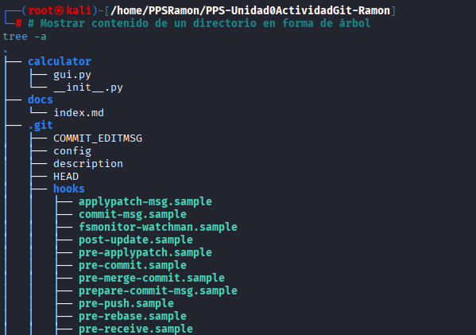 
1. Copiar el contenido de los ficheros entrando en cada uno
  
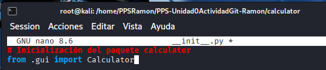  
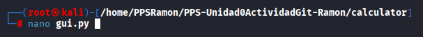  
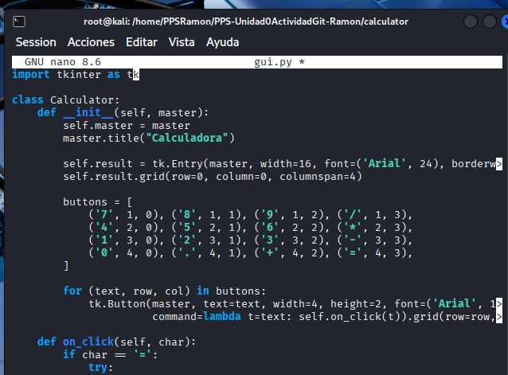  
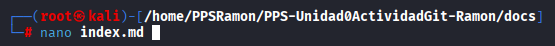  
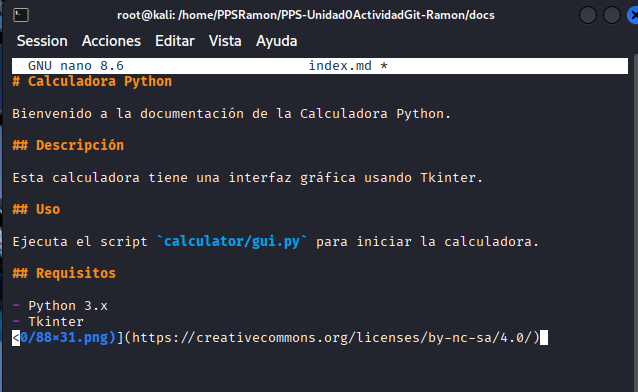  
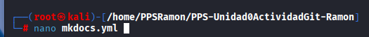  
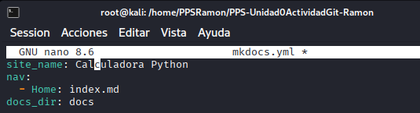
1. Volver a comprobar el estado de los archivos.  
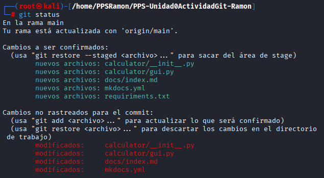  
1. Añadirlos al área staged.
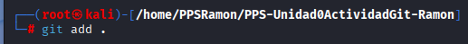
1. Crear commit con comentario.  
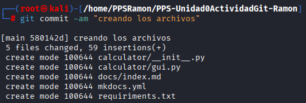  
1. Subir los archivos al repositorio remoto.
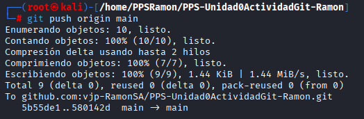
1. Revisar en github si están subidos correctamente.   
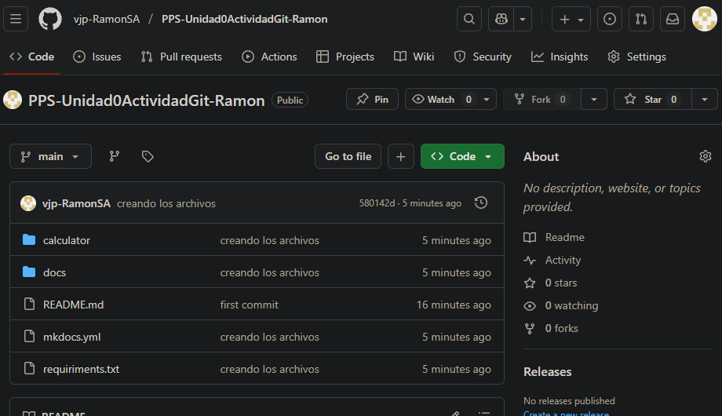 

---

## Creación de Proyecto y repositorio
1. Crear carpeta `Excluded` y entrar en ella.
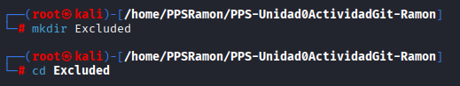  
1. Crear archivo vacío en la carpeta antes creada.
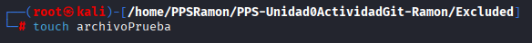  
1. Crear archivo en el directorio principal con el nombre excluido.txt y algo de contenido.
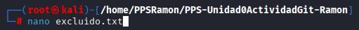  
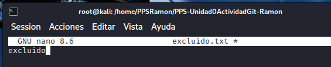
1. Hacer un .gitignore para poner los archivos y directorios para que no se rastreen o se sincronicen.  
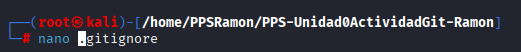  
1. Añadir lo necesario en el archivo.
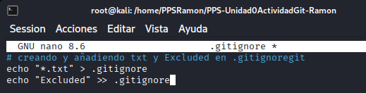
1. Crear la carpeta excluded y un archivo dentro 
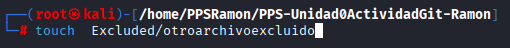
1. Crear archivo excluido.txt.  
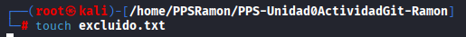
1. Hacer un commit.  
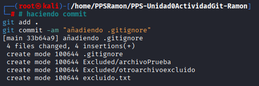
1. Comprueba el estado del proyecto y que no nos indica nada del seguimientos.  
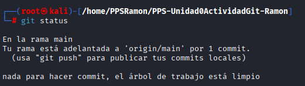  
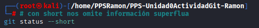  

---

## Levantar un pequeño Servidor Web con PHP
1. Crear un archivo html, hacer una copia del archivo y levantar un servidor web
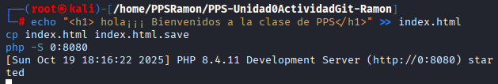
1. Entrar a través del navegador y con la url para ver que funciona correctamente.  
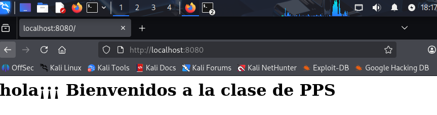 
1. Modificar el fichero html. 
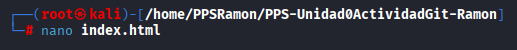  
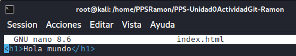
1. Refrescar la página para ver que cambia el mensaje.    
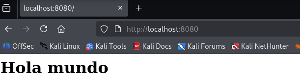
1. Añadir los cambios para que no de problemas más adelante y comprobar el estado.  
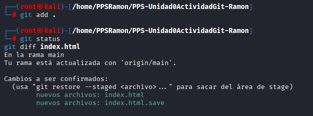
1. Hacer un `git restore` y refrescar el navegador para ver como vuelve el anterior mensaje.
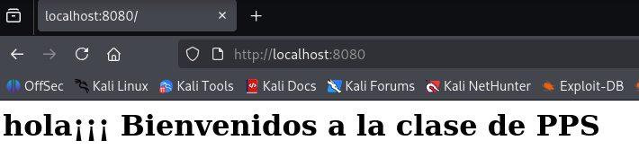 
1. Hacer un push y comprobar que se han subido correctamente. 
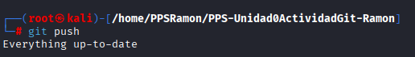
1. Añadir los cambios y utilizar el comando `git mv` para mover los archivos.  
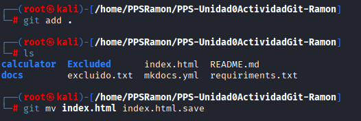
1. Hacer commit, ver el estado y subir los cambios.  
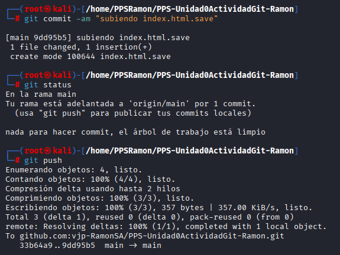
1. Mostrar los logs.  
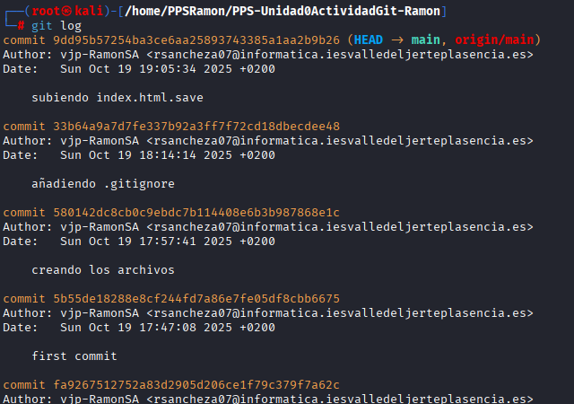
1. Muestra los logs de los últimos 3 commits 
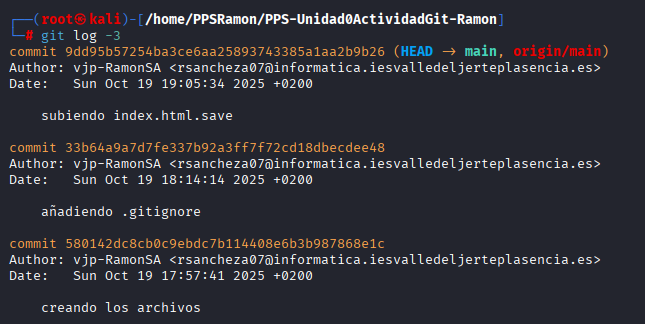 
1. Muestra los logs utilizando el modificador `--pretty` 
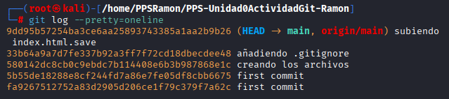  
1. Muestra los logs de los últimos 2 commits donde se vean las diferencias de cada una de las entradas.
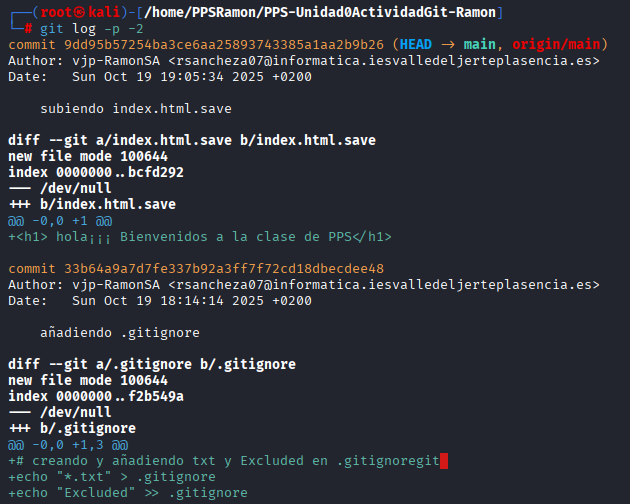  
1. Muestra los logs de las modificaciones realizadas en el último día.
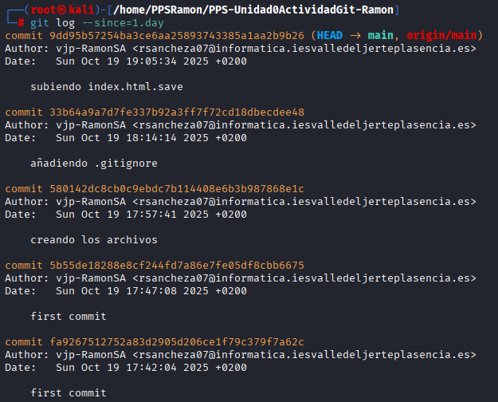  

---

## Ramas
1. Ver las ramas existentes.
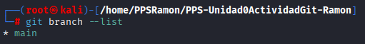 
1. Eliminar el archivo index.html.save y guardar las modificaciones.
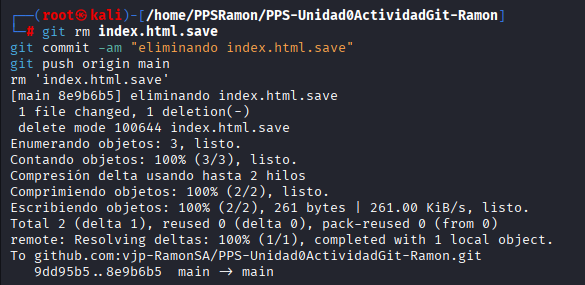
1. Crear la rama dev a partir de la actual.  
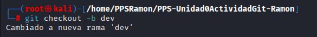
1. Subir los cambios al repositorio remoto de la rama dev 
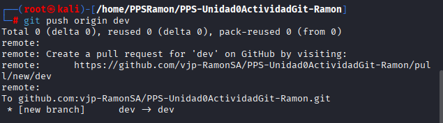

